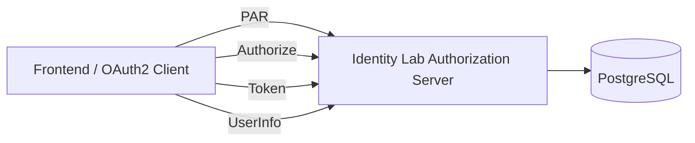
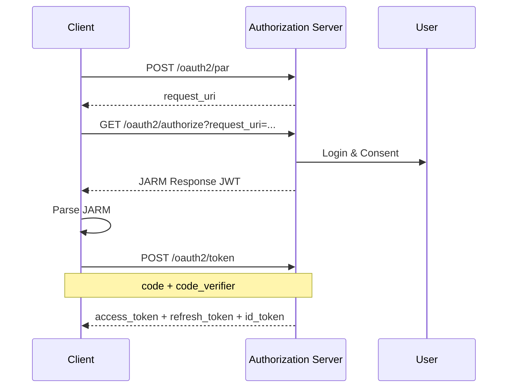
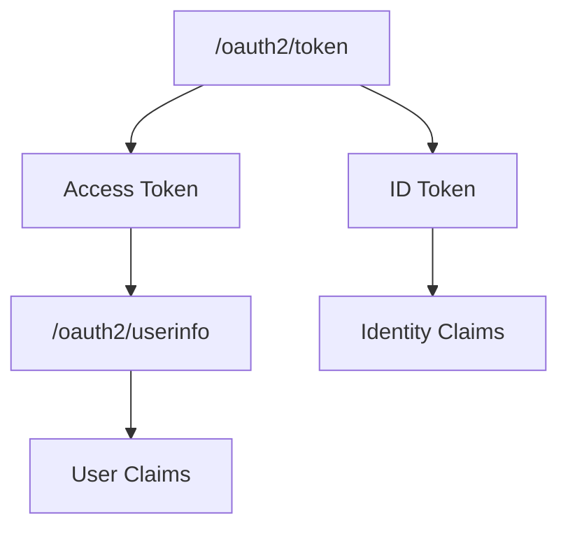
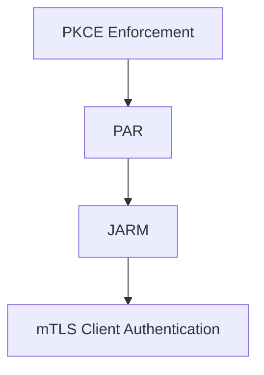

# Identity Lab

Identity & Access Management (IAM) Learning Project

A hands-on project for learning and implementing modern identity protocols and authorization standards, including JWT, OAuth 2.0, OpenID Connect (OIDC), and FAPI.

The goal is to gradually evolve this project from a simple JWT authentication system into a standards-compliant Authorization Server.

---

# Tech Stack

* Java 21
* Spring Boot 3
* Spring Security 6
* PostgreSQL
* Spring Data JPA
* JWT (JJWT)

---

# Architecture

---

# Features

## Authentication

* User Registration
* User Login
* BCrypt Password Encoding
* JWT Access Token
* Refresh Token

## Authorization

* Role-Based Access Control (RBAC)
* ROLE_USER
* ROLE_ADMIN
* Spring Security Authorization

## OAuth2 & OIDC

* OAuth2 Authorization Code Flow
* Dynamic Client Registration
* PKCE (RFC 7636)
* Pushed Authorization Requests (PAR)
* JWT Secured Authorization Response Mode (JARM)
* OpenID Connect (OIDC)
* ID Token
* UserInfo Endpoint
* OIDC Discovery Endpoint
* JWKS Endpoint
* RS256 JWT Signing
* Token Introspection
* Token Revocation
* Scope-based Authorization
* Refresh Token Rotation (Basic)

## FAPI

* PKCE Enforcement
* Pushed Authorization Requests (PAR)
* JWT Secured Authorization Response Mode (JARM)
* Mutual TLS (mTLS) Client Authentication

---

# OAuth2 Authorization Code + PKCE Flow

---

# OpenID Connect Flow

---

# FAPI Security Flow

---

# Roadmap

## Foundation

* [x] Spring Boot Initialization
* [x] PostgreSQL Integration
* [x] User Registration
* [x] User Login

## JWT

* [x] JWT Authentication
* [x] JWT Filter
* [x] Refresh Token
* [x] SecurityContext Integration

## Authorization

* [x] RBAC
* [x] ROLE_USER
* [x] ROLE_ADMIN
* [x] Admin Endpoint Protection

## OAuth 2.0

* [x] Client Registration
* [x] Dynamic Client Registration
* [x] Authorization Code Flow
* [x] Authorization Code Persistence
* [x] Access Token Issuance
* [x] Refresh Token Issuance
* [x] Token Introspection
* [x] Token Revocation

## PKCE

* [x] Code Verifier
* [x] Code Challenge
* [x] S256 Support
* [x] PKCE Enforcement

## OpenID Connect

* [x] ID Token
* [x] UserInfo Endpoint
* [x] OpenID Scope Validation
* [x] OIDC Discovery Endpoint
* [x] JWKS Endpoint
* [x] RS256 Signing
* [x] Issuer (iss)
* [x] Audience (aud)

## FAPI

* [x] PKCE Enforcement
* [x] PAR (Pushed Authorization Requests)
* [x] JARM
* [x] MTLS Client Authentication

---

# Demo

## frontend-demo.html

Demonstrates:

* Login
* ID Token Parsing
* UserInfo Endpoint

## frontend-demo-jarm.html

Demonstrates:

* JARM Response Parsing
* Authorization Code Extraction
* OAuth2 Authorization Flow Visualization

---

# Learning Goal

Build a mini identity platform from scratch and gradually evolve it into an OAuth2 / OIDC / FAPI compliant Authorization Server.

---

# Future Work

* OAuth 2.1
* DPoP (Demonstration of Proof-of-Possession)
* OAuth 2.0 Token Exchange
* Spring Authorization Server Migration
